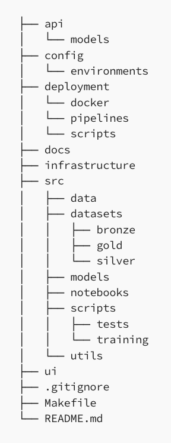

# BottleAROL

## Set Virtual Environment

```
# Create a virtual environment
python3 -m venv venv

# Activate the virtual environment
source venv/bin/activate
```

## Project Architecture



| Directory/File                  | Description                                                                                                      |
|---------------------------------|------------------------------------------------------------------------------------------------------------------|
| `api`                           | Contains source code for the project’s Application Programming Interface (API), enabling user interaction with the most current model. |
| `api/models`                    | Deployment-ready models, copied from the `src/models` directory via a CI/CD pipeline.                            |
| `config`                        | Central repository for configuration files, including settings for the project’s API, user interface (UI), and model code. |
| `config/environments`           | Contains environment-specific configuration files, with dotenv frequently utilized for managing configurations across different settings. |
| `deployment`                    | Contains all deployment and packaging-related files.                                                            |
| `deployment/docker`             | Dedicated to containing Docker files, accommodating projects that require multiple Docker images.                |
| `deployment/pipelines`          | Stores multiple pipelines essential for various project stages, such as model training and testing pipelines. Placement of these pipelines should comply with CI/CD system requirements (e.g., GitHub Actions necessitates that workflow files be located in a directory named `.github/workflows` at the repository root). |
| `deployment/scripts`            | Scripts employed in deployment or packaging processes are stored here.                                           |
| `docs`                          | Global documentation detailing model development, training processes, and testing methodologies, including architectural overview of the API and UI. |
| `infrastructure`                | Contains all Infrastructure as Code (IaC) files, whether they are Terraform, CloudFormation, or custom scripts.  |
| `src`                           | Source code for all phases of model development, testing, and training.                                          |
| `src/data`                      | Scripts for data collection and processing are kept in this directory.                                           |
| `src/datasets`                  | Both raw and processed data are stored here. The medallion architecture is preferred for categorizing datasets.  |
| `src/datasets/bronze`           | Raw collected data.                                                                                              |
| `src/datasets/silver`           | Filtered, cleaned, and augmented data.                                                                           |
| `src/datasets/gold`             | Curated, business-ready data.                                                                                    |
| `src/models`                    | All trained and tested models are housed here; each model should be meticulously versioned using semantic versioning. |
| `src/notebooks`                 | Jupyter notebooks for exploratory data analysis and experimental models.                                         |
| `src/scripts`                   | Scripts related to model development, testing, and training.                                                     |
| `src/models/tests`              | Scripts dedicated to testing trained models.                                                                     |
| `src/models/training`           | Contains scripts for training models.                                                                            |
| `src/utils`                     | Houses scripts that do not specifically pertain to development, testing, or training.                            |
| `ui`                            | If the application includes a user interface, all related source code should be stored in this directory.        |
| `Makefile`                      | Utilized for automating common tasks.                                                                            |
| `README.md`                     | Provides comprehensive documentation for the repository’s code.                                                  |
